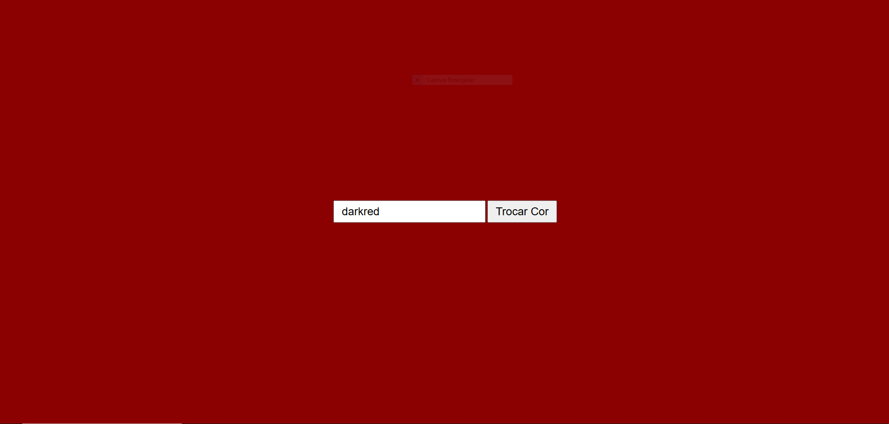

# Trocar cor da pagina web

## Nicolas

---
### Sobre
Projeto para trocar a cor de uma pagina web utilizando javascript.

---
## Tecnologias utilizadas
- HTML
- CSS
- JS

---
# Autor
- [Nicolas Lima](https://github.com/n1ckzao)